# OCI LB TrafficManagement
This repository has practical use case for LB and Global Region Traffic Management Policies

# IMPORTANT
To complete this lab, you must have an OCI account, not all services are free tier, but you should be able to complete all the lab with an active OCI trial account, if don't have one [Click Here](https://www.oracle.com/cloud/free/)

Also, to complete the Traffic Management Policies on OCI, you need to have an active DNS registration name, if don't have one, you can use [Freenom](https://www.freenom.com/)
## Summary
In this lab you are going to configure and create on OCI:
- **Network**
- **Security Lists / Network Security Groups**
- **Create Compute Instances**
- **Install and Configure HTTPD**
- **Create and Configure Load Balancers**
- **Create Public Zones**
- **Configure Public DNS Zones and Specific IPs**
- **Create an Global Traffic Management Policy**
- **Create Health Checks for your Infrastructure**
- **Put it all together to manage the network traffic of your application**
## Required tools to create this DEMO

- [**OCI TENANT**](https://www.oracle.com/cloud/free/)
- [**Free Register of DNS name**](https://www.freenom.com/)
# START
## TASK1: Generate SSH Keys
The SSH (Secure Shell) protocol is a method for secure remote login from one computer to another. SSH enables secure system administration and file transfers over insecure networks using encryption to secure the connections between endpoints. SSH keys are an important part of securely accessing Oracle Cloud Infrastructure compute instances in the cloud.

We recommend you use the [Oracle Cloud Shell](https://docs.oracle.com/en-us/iaas/Content/API/Concepts/cloudshellintro.htm) to interface with the OCI compute instance you will create. Oracle Cloud Shell is browser-based, does not require installation or configuration of software on your laptop, and works independently of your network setup.

IMPORTANT: If the SSH key is not created correctly, you will not be able to connect to your environment and will get errors. Please ensure you create your key properly.

To start the Oracle Cloud shell, go to your Cloud console and click the cloud shell icon at the top right of the page.
<p align="center">
  
</p>

Once the cloud shell has started, enter the following commands. Choose the key name you can remember. This will be the keyname you will use to connect to any compute instances you create. Press Enter twice for no passphrase

```hcl
mkdir .ssh
cd .ssh
ssh-keygen -b 2048 -t rsa -f <your SSH key name>
```

Note in the output that there are two files, a private key and a public key. Keep the private key safe and don't share its content with anyone. The public key will be needed for various activities and can be uploaded to certain systems as well as copied and pasted to facilitate secure communications in the cloud.

To list the contents of the public key, use the cat command:
```hcl
cat <your SSH key name>.pub
```
Copy the contents of the public key and save it somewhere for later. When pasting the key into the compute instance in future labs, make sure that you remove any hard returns that may have been added when copying. The .pub key should be one line.

## TASK2: Create Network - VCN
From the OCI Services menu, click Virtual Cloud Networks under Networking. Select the compartment assigned to you from drop down menu on left part of the screen under Networking and Click Start VCN Wizard.
*NOTE:* Ensure the correct Compartment is selected under COMPARTMENT list

Fill out the dialog box:

```hcl
VCN NAME: Provide a name
COMPARTMENT: Ensure your compartment is selected
VCN CIDR BLOCK: Provide a CIDR block (10.0.0.0/16)
PUBLIC SUBNET CIDR BLOCK: Provide a CIDR block (10.0.1.0/24)
PRIVATE SUBNET CIDR BLOCK: Provide a CIDR block (10.0.2.0/24)
```

Click Next
Verify all the information and Click Create.

This will create a VCN with followig components:
VCN, Public subnet, Private subnet, Internet gateway (IG), NAT gateway (NAT), Service gateway (SG)
## TASK3: Create Two Compute Instance and Install Web Server
Switch to the OCI console. From OCI services menu, Click Instances under Compute.

Click Create Instance. Fill out the dialog box:

```hcl
Name your instance: Enter a name
Choose an operating system or image source: For the image, we recommend using the Latest Oracle Linux available. It is the default selection.
Availability Domain: Select availability domain
Instance Shape: Click on change shape if you want to use a different shape from the default one
Under Configure Networking
Virtual cloud network compartment: Select your compartment
Virtual cloud network: Choose the VCN you created earlier
Subnet Compartment: Choose your compartment.
Subnet: Choose the Private Subnet
Use network security groups to control traffic : Leave un-checked
Configure Boot Volume: Leave the default choices
Add SSH Keys: Choose 'Paste SSH Keys' and paste the Public Key you created in Cloud Shell earlier. Ensure when you are pasting that you paste one line
```

NOTE: The lab instruction places the instances on a <b>private subnets</b>. If you wish to access them, you can create the Bastion Service and create an SSH Session.

If you want to manually provision and configure the Apache on each instance, you can create the instance now, proceed to TASK 4.

<b>To skip the next step, you can use the "Cloud-Init" to paste all the required instance configuration procedures to be executed automatically after the instance creation, if you do so, there's no need to SSH into the instace to configure the Web Server</b>

<p align="center">
  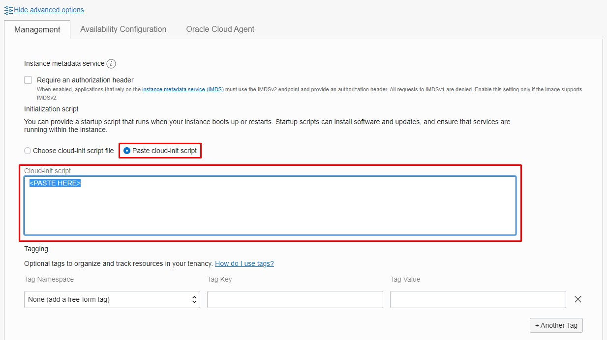
</p>

Paste this script on the "Cloud-Init Script" location (sa-saopaulo-1) instances:
```hcl
#! /bin/bash
sudo setenforce 0
sudo yum clean all
sudo yum -y update
sudo yum -y install httpd
sudo systemctl start httpd
sudo systemctl enable httpd
sudo firewall-cmd --permanent --zone=public --add-service=http
sudo firewall-cmd --permanent --zone=public --add-service=https
sudo firewall-cmd --reload
sudo -s 
cat <<EOF > /var/www/html/index.html
<!DOCTYPE html>
<html lang="pt-br">
<head>
    <meta charset="UTF-8">
    <meta name="viewport" content="width=device-width, initial-scale=1.0">
    <title>OCI Load Balancer</title>
</head>
<body>
    <center> <h1>The Cloud Bootcamp</h1>
            <h2>Instance provisioned and running Apache with success &#x270C;</h2>
            <h2>Instance region: sa-saopaulo-<Instance Number ID></h2>
            <hr>
            
    </center>
</body>
</html>
EOF
```
Paste this script on the "Cloud-Init Script" location (us-ashburn-1) instances:
```hcl
#! /bin/bash
sudo setenforce 0
sudo yum clean all
sudo yum -y update
sudo yum -y install httpd
sudo systemctl start httpd
sudo systemctl enable httpd
sudo firewall-cmd --permanent --zone=public --add-service=http
sudo firewall-cmd --permanent --zone=public --add-service=https
sudo firewall-cmd --reload
sudo -s 
cat <<EOF > /var/www/html/index.html
<!DOCTYPE html>
<html lang="pt-br">
<head>
    <meta charset="UTF-8">
    <meta name="viewport" content="width=device-width, initial-scale=1.0">
    <title>OCI Load Balancer</title>
</head>
<body>
    <center> <h1>The Cloud Bootcamp</h1>
            <h2>Instance provisioned and running Apache with success &#x270C;</h2>
            <h2>Instance region: us-ashburn-<Instance Number ID></h2>
            <hr>
            
    </center>
</body>
</html>
EOF
```

Using the same method, create 2 instances on each region, just change the Instance Number ID so when you test using your browser you can see the Load Balancer Round-Robin mechanism working.

- [**OPTIONAL**]
If you want to use [Bastion Service](https://docs.oracle.com/en-us/iaas/Content/Bastion/Concepts/bastionoverview.htm) to access your instance, on the creation process, go to "Advanced Options" -> "Oracle Cloud Agent" and select the checkbox to enable "Bastion"
<p align="center">
  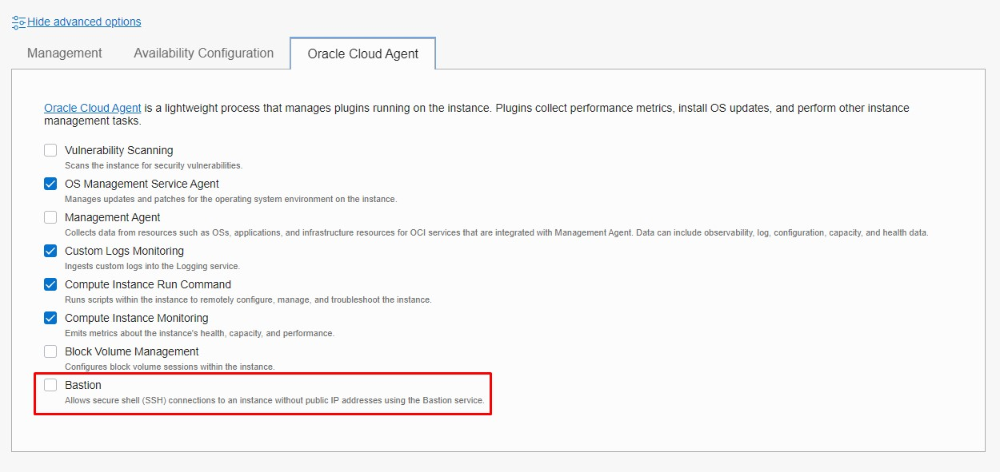
</p>

After compleating this TASK you should have on your OCI account:
- **VCN completed on Sao Paulo region**
- **2 Instances on Running State on Sao Paulo region**
- **VCN completed on Ashburn region**
- **2 Instances on Running State on Ashburn region**

## TASK4: Install Apache on each Instance
This task let's you configure manually the Apache server on each instance. <b><i>Since we created the instance on the private subnet, you need to use the Bastion Service to SSH, look at the [getting started](https://docs.oracle.com/en-us/iaas/Content/Bastion/Concepts/bastionoverview.htm#get-started) of the service to create the Bastion and then create the session to copy the SSH command</i></b>
<p align="center">
  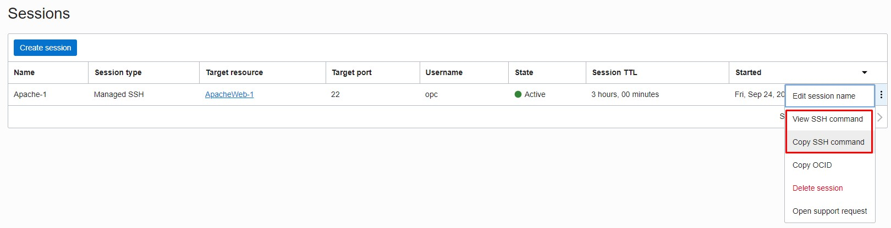
</p>

After you access the instance, enter these commands to install and configure Apache:

Install Apache HTTP Server
```hcl
sudo yum -y install httpd
```
Open TCP port 80 in the local firewall
```hcl
sudo firewall-cmd --permanent  --add-port=80/tcp
```
Reload the firewall to activate the rules
```hcl
sudo firewall-cmd --reload
```
Start the web server
```hcl
sudo systemctl start httpd
sudo systemctl enable httpd
```

Create the index.html file as root (you can use VI editor). The content of the file will be displayed when the web server is accessed, use the HTML code in this LAB at the Optional part of the "Cloud-Init" setup, you can copy and paste the code in each instance depending of the region.

## TASK5: Create Load Balancer
Now that we have the Instances up and running with Apache configured, let's create the Load Balancer to use both instances, since we are going to work with Edge services as well, we need to create two Load Balacers, one in each region that we are going to provide our application. This use case is the same for real customers that want to deploy their application on multi regions across the globe, to see the overall architecture of this deployment check this [link](https://docs.oracle.com/en/solutions/ha-web-app/index.html#GUID-D92DB4A1-5816-4F95-A0F5-57821B0F3EBF). The deployment we are going to create is very similar, just add one more region and put on top the DNS and Traffic Management Edge Services.

**Create the Load Balancer**
From OCI Services menu, Click Load Balancers under Networking.
<p align="center">
  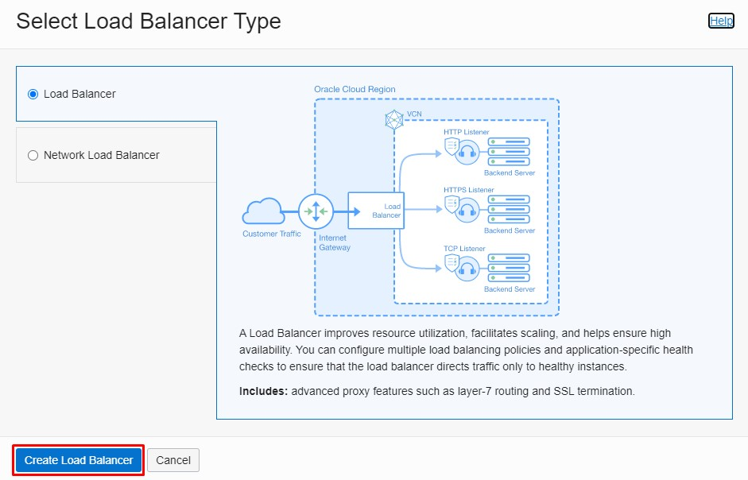
</p>
Click Create Load Balancer. Fill out the dialog box:
```hcl
LOAD BALANCER NAME: Enter a name for your load balancer.
CHOOSE VISIBILITY TYPE: Public
CHOSSE FLEXIBLE SHAPE
CHOOSE THE MINIMUM BANDWIDTH: 10Mbps
VIRTUAL CLOUD NETWORK: Choose your Virtual Cloud Network
SUBNET: Choose the Regional Subnet we created
```
Click Next or Choose Backends:
<p align="center">
  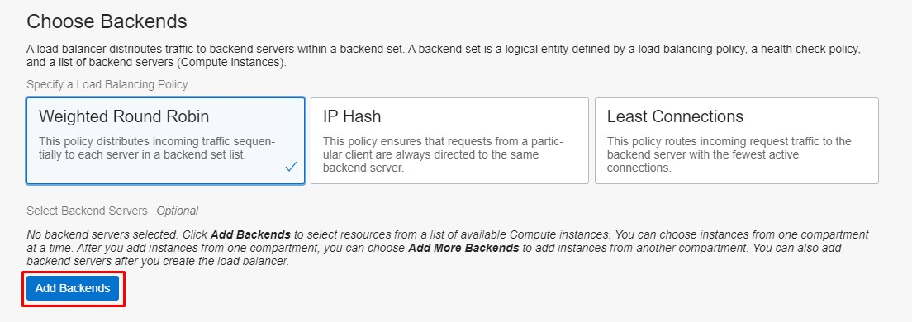
</p>
SPECIFY A LOAD BALANCING POLICY: Weighted Round Robin
Click Add Backend and choose the two compute instances created earlier
<p align="center">
  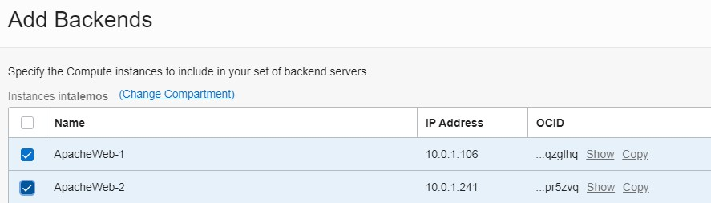
</p>
Configure the Listener:
<p align="center">
  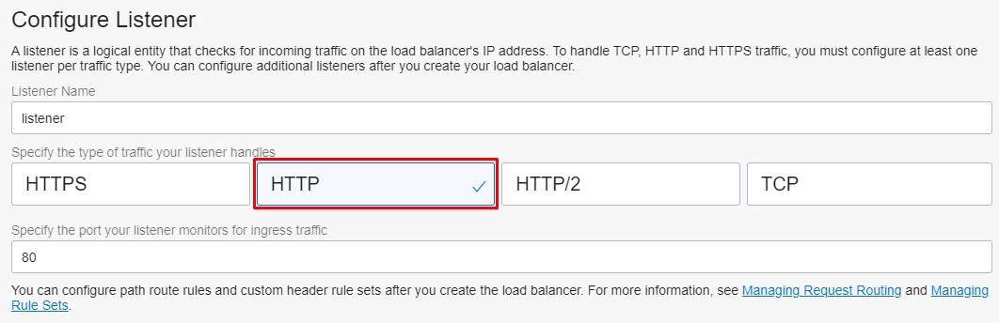
</p>
SPECIFY THE TYPE OF TRAFFIC YOUR LISTENER HANDLES: HTTP
SPECIFY THE PORT YOUR LISTENER MONITORS FOR INGRESS TRAFFIC: 80

<b>If you want to enable the Logs, just use the defaults options for "Create a new log group"</b>
<p align="center">
  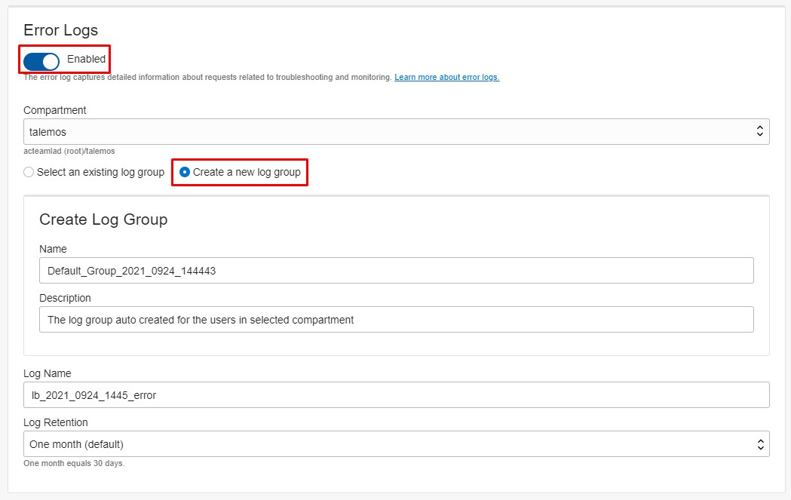
</p>
Use this option for "Error" and "Access" logs

After these steps, you can create the Load Balancer and wait untill it's available.
Can you test the application as soon it's available? What's the problem with the access?

## TASK6: Configure Security
Now it's time to configure the Security Lists to open the ports to connect your Load Balancer to the Internet and also to open the conectivity to the Load Balancer to your Apache Instances private sub network.

To complete this, let's first open the Load Balancer listener to the Internet, first make sure your public subnet has Internet Gateway and the Route Table has the trafic route configured:
<p align="center">
  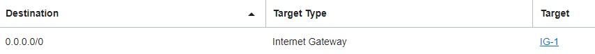
</p>
You need to have the route: 0.0.0.0/0 to your Internet Gateway on the public subnet, otherwise you won't route the traffic from the Internet to the Load Balancer Listener.

Now create or alter the existing Security List for the public subnet on your VCN to add these configurations:
Click Add Ingress Rule. Click +Additional Ingress Rule and enter the following ingress rule; Ensure to leave STATELESS flag un-checked
```hcl
Source Type: CIDR
Source CIDR: Enter 0.0.0.0/0.
IP Protocol: Select TCP.
Source Port Range: All.
Destination Port Range: Enter 80 (the listener port).
```
<b>Click Add Ingress Rule.</b>

Click Egress Rule under Resources. Click Add Egress Rule, Click +Additional Egress Rule and enter the following Egress rule; Ensure to leave STATELESS flag un-checked.
```hcl
Destination Type: CIDR
Destination CIDR: 0.0.0.0/0
IP Protocol: Select TCP.
Destination Port Range: All.
```
<b>Click Add Egress Rule.</b>

Now create or alter the existing Security List for the private subnet on your VCN to add these configurations:
This private subnet is were your Apache instances are located.

Click Add Ingress Rule. Click +Additional Ingress Rule and enter the following ingress rule; Ensure to leave STATELESS flag un-checked
```hcl
Source Type: CIDR
Source CIDR: <Your Public Subnet CIDR>
IP Protocol: Select TCP.
Source Port Range: All
Destination Port Range: 80
```
<b>Click Add Ingress Rule.</b>

Now you should be able to call your application from the public IP of the Load Balancer, you can also do the same network configuration using ["Network Security Groups"](https://docs.oracle.com/en-us/iaas/Content/Network/Concepts/networksecuritygroups.htm). Remeber to also configure the security of the other region, you need to replicate these steps to also complete the second region configuration.

<b>Note:</b> Be sure to take note of the "Health" field in the Networking -> Load Balancers dashboard. If the health is "Critical," the load balancer may not work as intended, you need to troubleshoote the reason why, could be some lack of configuration with security or other network issue, plase follow this [link](https://docs.oracle.com/en-us/iaas/Content/Balance/Troubleshooting/common_load_balancer_errors.htm#health_check_errors) to verify the problem.

## TASK7: Configure DNS Zones
<b><i>If you don't want to create an account on Freenon, then you need to stop the LAB here, the rest of the DNS configuration and Traffic Management can only be accomplish with the DNS name created.</i></b>

Register your free DNS at Freenon, you can choose from any available free domain. I have created "thiagolemos.ga"
Let's continue the setup of the Public Zone:
Go on the console -> network -> DNS Management
<p align="center">
  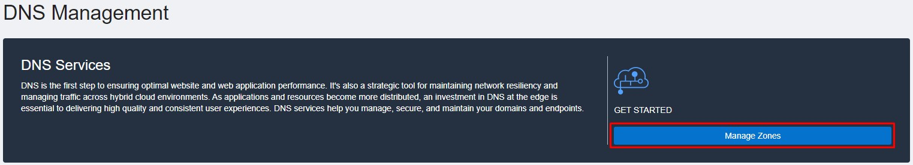
</p>
Click on the "Manage Zones"

Create a new Public Zone:
<p align="center">
  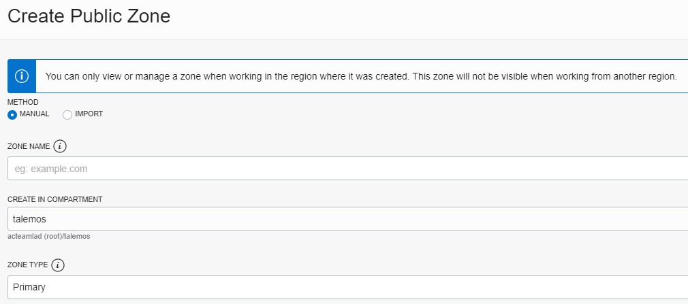
</p>
Enter your zone name, the same you created on Freenon, my case was: thiagolemos.ga, also choose your compartment and choose the zone as "Primary", click on Create.

Once it completes, enter into your public zone, go into the "records" and create a new record:
<p align="center">
  
</p>
Just create with a subdomain, like "web", the complete name could be web.thiagolemos.ga, but you can choose any other.
On the "Address" field, enter the Public IP of your Load Balancer. Once you completed this you have created an URL to reach your Public Load Balancer from the Internet (WWW), if you open your Browser and type the full URL you just created, the Apache index.html page should appear.

## TASK8: Configure Traffic Management
To complete the configuration using Traffic Management, go to the console -> network -> traffick management steering policies
Click on Create:
<p align="center">
  
</p>
Choose the "GEOLOCATION STEERING" Policy, the rest of the configuration it's going to change based on the type o policy selected.
Complete the configuration with these parameters:
```hcl
POLICY NAME: Your policy name
POLICY TTL: 60
Answer Pool(s)
Answer Pool 1
ANSWER POOL NAME: Brazil Pool
Answers:
NAME: Sao Paulo
TYPE: A
RDATA: <Public Load Balancer IP from Sao Paulo Region>
Answer Pool 2
ANSWER POOL NAME: Ashburn Pool
Answers:
NAME: Ashburn
TYPE: A
RDATA: <Public Load Balancer IP from Ashburn Region>
Geolocation Steering Rules
Rule 1
GEOLOCATION: Choose Brazil Geolocation and Choose South America Geolocation
Pool Priority:
Pool 1: Select Brazil Pool
Pool 2: Select Ashburn Pool
Click on the "+Additional Rule"
Rule 2
GEOLOCATION: Choose Ashburn Geolocation and Choose North America Geolocation
Pool Priority:
Pool 1: Select Ashburn Pool
Pool 2: Select Brazil Pool
You can add "Global Catch-All Rule" in case the client is neither on North or South Americas, but that's not needed for this lab.
Create a new "Health Check" for this rule, just as the screen below:
<p align="center">
  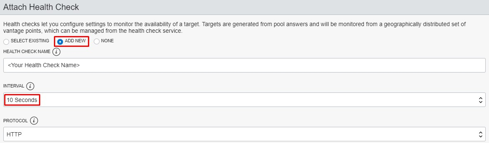
</p>
Change the INTERVAL for 10 seconds
On the "Attached Domain(s) (Optional)"
SUBDOMAIN: <YOUR SUB DOMAIN CREATED>
COMPARTMENT: The compartment you are using for this lab
ZONE: <YOUR PUBLIC ZONE>
```
<b>Create the Policy</b>

Once you completed this configuration, the public IP of your Load Balancer on the Public Zone is going to be "occluded by Steering Policy", with means that depending on the client region request for this name, the client is going to be redirected to the corresponding Load Balancer for nearest application available to him.

In this case, we have only 2 regions available, but you could create as many regions as you want, and also, if any region fails to complete the client request, there's a fail over to the second option on the policy, in this case, even for a client in North America if the environment in Ashburn is not available, the client is going to be redirected to the South America region and the fail over is automatic.

You can check this consulting the "Health Check" page on console -> observability & management -> health checks:
If enter the Health Check you created during the process to create the policy, you going to check the status of your Load Balancers in each region
<p align="center">
  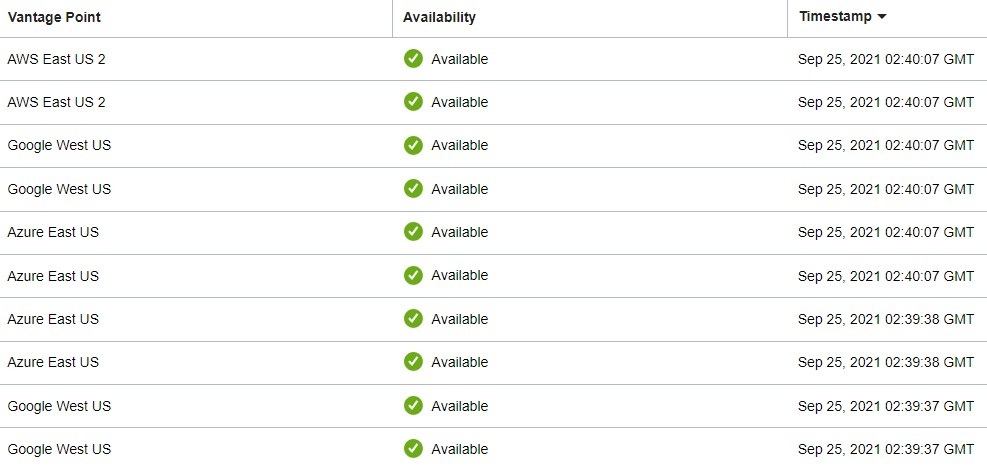
</p>
We use different vantage points to create HTTP access and measure the availability of the resource, if there's a problem the pool is switched automatic, if you want to see the error, just remote the configuration of the Security List to allow the access from the Internet to the Load Balancer HTTP listener.

You can create a "fake" error on the Health Check and the policy is going to route the request to the next available region.

## CONCLUSION
Thanks for completing this lab, hope you learned about traffic management and how to make your solutions more reliable and scalable in the cloud. Another great vantage of this type of Architecture is the downtime for patching the infrastructure, you can take an entire region out and still be available for your customers.